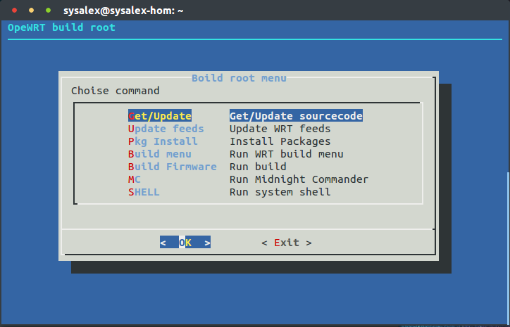

### USE

**Get image**
```sh
docker pull sysalex/openwrt-build:1.0.0
```

**Run container**
```sh
docker run -t -i -d --name wrt-build -v /srv/wrt:/data sysalex/openwrt-build:1.0.0
```

**Attach to container console**
```sh
docker attach wrt-build
```


